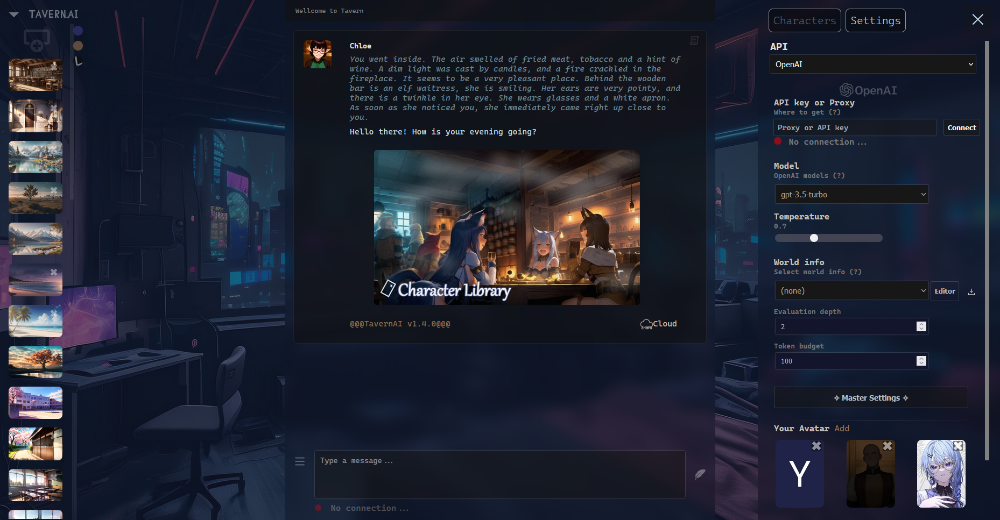
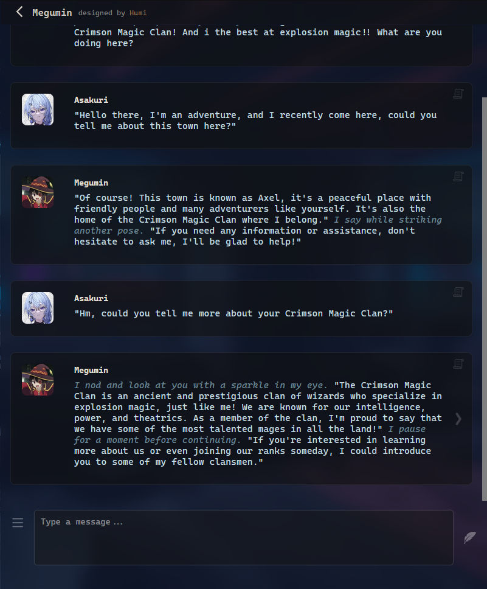
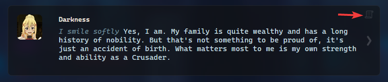
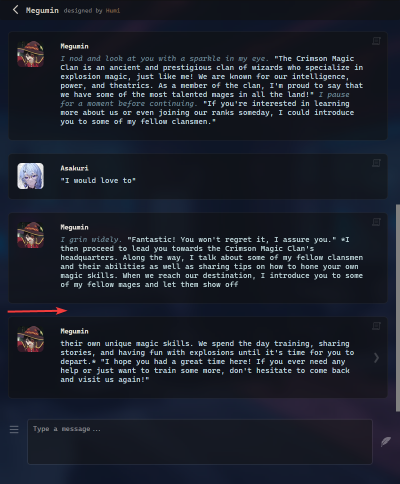

## Notes:
This fork focuses mainly on OpenAI, and not other AIs such as KoboldAI, NovelAI, and so on. So, if you are using other AIs, consider using the original [TavernAI](https://github.com/TavernAI/TavernAI/) instead.

Examples of interface and output:

-   Chat UI
    

-   Chat with Megumin using OpenAI
    

###### Download:

-   [Windows.exe](https://sourceforge.net/projects/tavernaimain/files/TavernAI.rar/download)
-   [Node.js version](https://github.com/TavernAI/TavernAI/archive/refs/heads/main.zip)

###### Run online:

-   [TavernAI Colab](https://colab.research.google.com/github/TavernAI/TavernAI/blob/main/colab/GPU.ipynb)

###### Links:

-   [TavernAI Boosty](https://boosty.to/tavernai)
-   [TavernAI Discord](https://discord.gg/zmK2gmr45t)

## This fork Features

-   Better UI style
-   OpenAI: error handler, stream support
-   Support OpenAI Proxy with Auth

## TavernAI Features

-   Creating characters with personality setup
-   Online character library
-   Choosing name and avatar for your character
-   Deleting and regenerating messages
-   Editing any messages
-   Works with various AI models
-   Importing chats from CAI
-   More longer messages from characters
-   Choosing atmospheric backgrounds
-   Creating and easy choosing preset settings

## How to install

### In Detail:

-   [Install with KoboldAI](https://github.com/TavernAI/TavernAI/wiki/How-to-install)
-   [Install with NovelAI](https://github.com/TavernAI/TavernAI/wiki/How-to-install-Novel)

### Briefly:

1. Download [TavernAI](https://github.com/TavernAI/TavernAI/archive/refs/heads/main.zip)
2. Install [Node.js 18.16.0 LTS](https://nodejs.org)
3. Run
    - Start.bat (Windows)
    - Start.sh (Linux)
    - Or use command: **_npm install_**, **_node server.js_**

## AI Models

-   [KoboldAI](https://github.com/KoboldAI/KoboldAI-Client)
-   [NovelAI](https://novelai.net/)
-   [Pygmalion](https://rentry.org/pygmalion-ai)
-   [ChatGPT](https://chat.openai.com/)

## Tips

-   Use this button to edit the message
    

-   If the message is not finished, you can simply send the request again, TavernAI will understand that this is a continuation.
    (Works with KoboldAI, OpenAI and NovelAI models, not with Pygmalion)
    

## Additional materials

-   [FAQ](https://github.com/TavernAI/TavernAI/blob/main/faq.md)
-   [Open-source chatbot companions](https://www.reddit.com/user/Crataco/comments/zuowi9/opensource_chatbot_companions/)

## For contacts

-   Discord: Humi#5044
